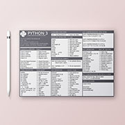
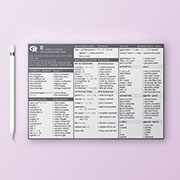
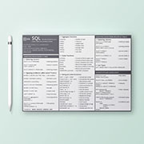
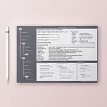
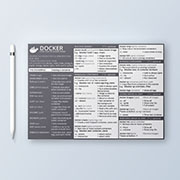

# CODING CHEAT SHEETS

## 1. Description

In this repository, you can find coding **cheat sheets** as a **free** and **open resource**. 

All these cheat sheets try to provide a balance between clean and complete content. The printed format is a **Din-A6** 148x105mm, and the resolution is **HD** 1748x1240px. I established these dimensions, thinking of having them as an auxiliary element in a small paper or tablet.

<table>
    <tr>
        <td></td>
        <td></td>
        <td></td>
        <td></td>
        <td></td>
    </tr>
</table>

## 2. Contents

On the latest update, you can find five cheat sheets about the following points:

- Python + Numpy + Pandas
- R (Statistical Computing) + ggplot
- SQL (Structured Query Language)
- Python Projects Structure
- Docker

The cheat sheets are in **PNG** and **PDF** format inside different directories.

## 3. Usage

All the cheat sheets are made to be read from the up-left to the down-righ following the vertical columns. The can be used on paper or digital format.

## 4. Help wanted

This repository is not static, and the content will be updated and upgraded with more cheat sheets. Although if you see any mistake, please fell free to add a new issue.

## 5. Links

More resources like these [here](https://carlosgrande.me/)

## Acknowledgements

**Thanks for viewing my work!**

<a href="https://carlosgrande.me/">carlosgrande.me</a>

